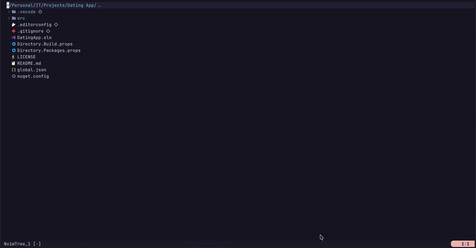

# simpleterm.nvim

A minimal, fast, and beautiful floating terminal plugin for Neovim.


## 📸 Screenshots




## ✨ Features

- 🚀 **Fast** - Optimized for instant toggle performance
- 🎨 **Beautiful** - Smart mode indicator with position tracking
- ⚙️ **Configurable** - Sensible defaults, fully customizable
- 🎯 **Zero dependencies** - Pure Lua, works out of the box
- 🔄 **Persistent** - Terminal state preserved when toggled
- 🌈 **Colorscheme aware** - Automatically adapts to your theme
- 📋 **Smart yank** - Visual yank strips PTY line breaks, with footer flash confirmation
- 📚 **Well documented** - Built-in help docs (`:help simpleterm`)

## ⚙️ Requirements

- **Neovim** >= 0.8.0
- **[Nerd Font](https://www.nerdfonts.com/)** - Required for default mode icons
  - Not needed if you customize `mode_icons` to use plain text (see [Custom Mode Icons](#custom-mode-icons))

## 📦 Installation

### Using [lazy.nvim](https://github.com/folke/lazy.nvim)

```lua
{
  "latuconsinafr/simpleterm.nvim",
  config = function()
    require("simpleterm").setup()
  end,
}
```

### Using [packer.nvim](https://github.com/wbthomason/packer.nvim)

```lua
use {
  "latuconsinafr/simpleterm.nvim",
  config = function()
    require("simpleterm").setup()
  end,
}
```

### Using [vim-plug](https://github.com/junegunn/vim-plug)

```vim
Plug 'latuconsinafr/simpleterm.nvim'

" In your init.vim or after plug#end()
lua require("simpleterm").setup()
```

## 🚀 Quick Start

### Zero Configuration

Just install and use! The plugin works perfectly with default settings:

```lua
require("simpleterm").setup()
```

Press `\` to toggle the terminal.

### Basic Configuration

```lua
require("simpleterm").setup({
  window = {
    width = 0.8,        -- 80% of editor width
    height = 0.8,       -- 80% of editor height
    border = "rounded", -- Border style
  },
  keymaps = {
    toggle = "\\",   -- \ to toggle (set to false to disable)
  },
})
```

## ⚙️ Configuration

### Full Options

<details>
<summary>Click to see all configuration options</summary>

```lua
require("simpleterm").setup({
  -- Window configuration
  window = {
    width = 0.8,         -- Float: percentage (0.0-1.0), Int: columns
    height = 0.8,        -- Float: percentage (0.0-1.0), Int: rows
    border = "rounded",  -- "single", "double", "rounded", "solid", "shadow"
    row_offset = 0.1,    -- Vertical offset (0.0 = center, negative = up, positive = down)
  },

  -- Terminal configuration
  terminal = {
    shell = vim.o.shell,      -- Shell to use (defaults to system shell)
    start_in_insert = true,   -- Auto-enter insert mode when opening
  },

  -- Footer configuration
  footer = {
    enabled = true,           -- Show footer with mode indicator
    position = "right",       -- "left", "center", "right"
    show_mode = true,         -- Show mode icon
    show_position = true,     -- Show line position [current/total]
    show_search_count = true, -- Show search matches [current/total]
    yank_icon = "󰆏",          -- Icon flashed after a clean yank (false to disable, nil = fallback "Y")
    -- Customize mode icons (or use plain text)
    mode_icons = {
      t = "󰠠",                -- Terminal mode
      nt = "",               -- Terminal-normal mode
      n = "",                -- Normal mode
      v = "󱠆",                -- Visual mode
      V = "󱠆",                -- Visual line mode
      ["\22"] = "󱠆",          -- Visual block mode (Ctrl-V)
      c = "",                -- Command mode
      -- Any undefined mode will show as uppercase letter (e.g., "R", "I")
    },
  },

  -- Keymaps
  keymaps = {
    toggle = "\\",         -- Set to false to disable default keymap
    clean_yank = "gy",     -- Yank visual selection without PTY line breaks (false to disable)
  },
})
```

</details>

### Examples

#### Minimal Setup (No Footer)

```lua
require("simpleterm").setup({
  footer = {
    enabled = false,
  },
})
```

#### Custom Size & Border

```lua
require("simpleterm").setup({
  window = {
    width = 0.9,
    height = 0.9,
    border = "double",
  },
})
```

#### Custom Keymap

```lua
require("simpleterm").setup({
  keymaps = {
    toggle = false, -- Disable default keymap
  },
})

-- Set your own keymap
vim.keymap.set({"n", "t"}, "<C-\\>", require("simpleterm").toggle, { desc = "Toggle terminal" })
```

#### Custom Yank Icon

Use plain text if you don't have a Nerd Font installed (falls back to `"Y"` automatically if `nil`):

```lua
require("simpleterm").setup({
  footer = {
    yank_icon = "[y]", -- plain text fallback, no Nerd Font needed
  },
})
```

#### Custom Mode Icons

Use plain text if you don't have a Nerd Font installed:

```lua
require("simpleterm").setup({
  footer = {
    mode_icons = {
      t = "[TERM]",    -- Plain text - no Nerd Font needed!
      nt = "[NORM]",
      n = "N",
      v = "V",
      V = "V-LINE",
      c = ":",
      -- Any undefined mode shows as uppercase letter
    },
  },
})
```

## 🎮 Usage

### Default Keymaps

- `\` - Toggle terminal (works in normal and terminal mode)
- `gy` - Yank visual selection without PTY line breaks (visual mode, terminal buffer only)

### Smart Yank (`gy`)

Terminal output is hard-wrapped by the PTY at the window width, splitting one logical line into multiple buffer lines. `gy` in visual mode strips those artificial breaks before yanking, so pasting gives clean output.

- Single logical line selected → yanked as one clean line (no extra newlines)
- Genuinely multi-line selection → newlines preserved
- Works with all clipboard configurations (`clipboard=unnamedplus`, etc.)
- Footer flashes the yank icon briefly to confirm

### Commands

- `:SimpletermToggle` - Toggle floating terminal
- `:SimpletermOpen` - Open floating terminal (if not already open)
- `:SimpletermClose` - Close floating terminal (if open)

### API

```lua
local simpleterm = require("simpleterm")

-- Toggle terminal
simpleterm.toggle()

-- Open terminal (if not already open)
simpleterm.open()

-- Close terminal (if open)
simpleterm.close()

-- Get current state (for advanced usage)
local state = simpleterm.get_state()
-- Returns: { buf, win, is_valid, is_visible }

-- Get current configuration
local config = simpleterm.get_config()
```

## 🎨 Customizing Colors

The plugin automatically adapts to your colorscheme by linking to `FloatBorder`.

To customize the footer appearance, override the `SimpletermFooter` highlight group:

```lua
-- After your colorscheme is loaded (e.g., in your init.lua after colorscheme line)
vim.api.nvim_set_hl(0, "SimpletermFooter", {
  fg = "#f6c177", -- Text color
  bg = "#1f1d2e", -- Background color
  bold = true,
})
```

## 📝 Tips

### Help Documentation

View complete documentation in Neovim:
```vim
:help simpleterm
```

### Escaping Terminal Mode

Press `<C-\><C-n>` to exit terminal mode (default Neovim behavior).

Or add this to your config for easier escaping:

```lua
vim.keymap.set("t", "<Esc>", "<C-\\><C-n>", { desc = "Exit terminal mode" })
```

### Multiple Terminals

Currently, simpleterm focuses on a single, persistent terminal. This keeps the plugin minimal and fast. For multiple terminals, consider [toggleterm.nvim](https://github.com/akinsho/toggleterm.nvim) or [FTerm.nvim](https://github.com/numToStr/FTerm.nvim).

## 🤝 Contributing

Contributions are welcome! Please feel free to submit a Pull Request.

## 📄 License

MIT License - see LICENSE file for details.

## 🙏 Acknowledgments

Inspired by the excellent terminal plugins in the Neovim ecosystem:
- [FTerm.nvim](https://github.com/numToStr/FTerm.nvim)
- [toggleterm.nvim](https://github.com/akinsho/toggleterm.nvim)
- [vim-floaterm](https://github.com/voldikss/vim-floaterm)
